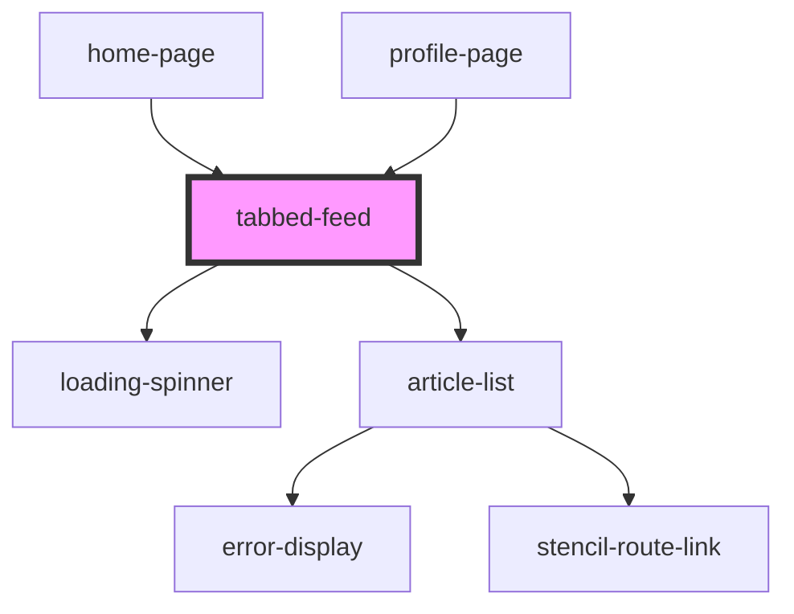

# tabbed-feed

<!-- Auto Generated Below -->

## Properties

| Property       | Attribute    | Description | Type          | Default      |
| -------------- | ------------ | ----------- | ------------- | ------------ |
| `activeTag`    | `active-tag` |             | `string`      | `undefined`  |
| `clearTag`     | --           |             | `() => void`  | `undefined`  |
| `isProfile`    | `is-profile` |             | `boolean`     | `undefined`  |
| `possibleTabs` | --           |             | `TTabTypes[]` | `['global']` |
| `profile`      | --           |             | `IProfile`    | `undefined`  |
| `user`         | --           |             | `IUser`       | `undefined`  |

## Dependencies

### Used by

 - [home-page](../routes/home)
 - [profile-page](../routes/profile)

### Depends on

- [loading-spinner](.)
- [article-list](.)

### Graph

----------------------------------------------

*Built with [StencilJS](https://stenciljs.com/)*
