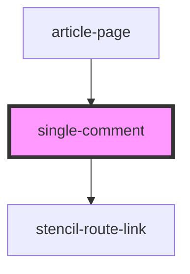

# single-comment

<!-- Auto Generated Below -->

## Properties

| Property        | Attribute | Description | Type                   | Default     |
| --------------- | --------- | ----------- | ---------------------- | ----------- |
| `comment`       | --        |             | `IComment`             | `undefined` |
| `removeComment` | --        |             | `(id: number) => void` | `undefined` |
| `slug`          | `slug`    |             | `string`               | `undefined` |
| `user`          | --        |             | `IUser`                | `undefined` |

## Dependencies

### Used by

 - [article-page](.)

### Depends on

- stencil-route-link

### Graph

----------------------------------------------

*Built with [StencilJS](https://stenciljs.com/)*
