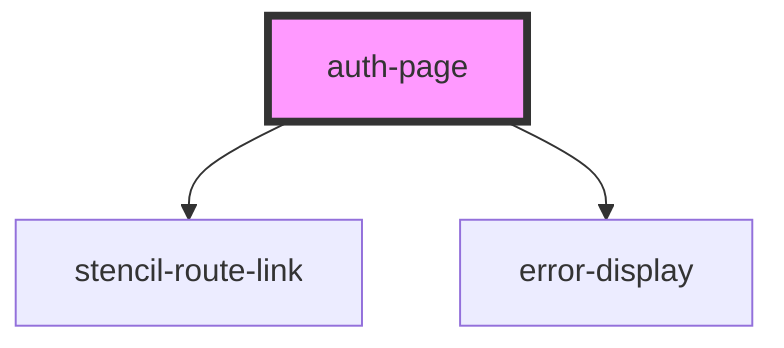

# auth-page

<!-- Auto Generated Below -->

## Properties

| Property  | Attribute | Description | Type                    | Default     |
| --------- | --------- | ----------- | ----------------------- | ----------- |
| `match`   | --        |             | `MatchResults`          | `undefined` |
| `setUser` | --        |             | `(user: IUser) => void` | `undefined` |

## Dependencies

### Depends on

- stencil-route-link
- [error-display](../../components)

### Graph

----------------------------------------------

*Built with [StencilJS](https://stenciljs.com/)*
