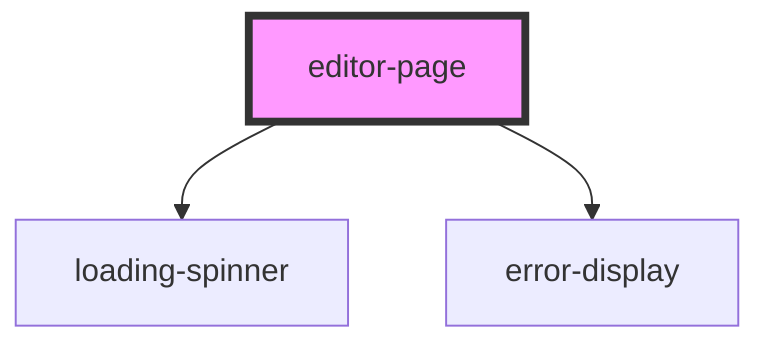

# editor-page

<!-- Auto Generated Below -->

## Properties

| Property  | Attribute | Description | Type            | Default     |
| --------- | --------- | ----------- | --------------- | ----------- |
| `history` | --        |             | `RouterHistory` | `undefined` |
| `match`   | --        |             | `MatchResults`  | `undefined` |
| `user`    | --        |             | `IUser`         | `undefined` |

## Dependencies

### Depends on

- [loading-spinner](../../components)
- [error-display](../../components)

### Graph

----------------------------------------------

*Built with [StencilJS](https://stenciljs.com/)*
