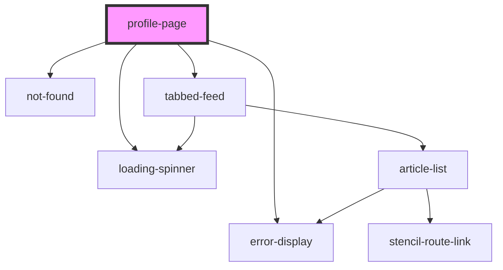

# profile-page

<!-- Auto Generated Below -->

## Properties

| Property | Attribute | Description | Type           | Default     |
| -------- | --------- | ----------- | -------------- | ----------- |
| `match`  | --        |             | `MatchResults` | `undefined` |
| `user`   | --        |             | `IUser`        | `undefined` |

## Dependencies

### Depends on

- [loading-spinner](../../components)
- [error-display](../../components)
- [not-found](../../components)
- [tabbed-feed](../../components)

### Graph

----------------------------------------------

*Built with [StencilJS](https://stenciljs.com/)*
